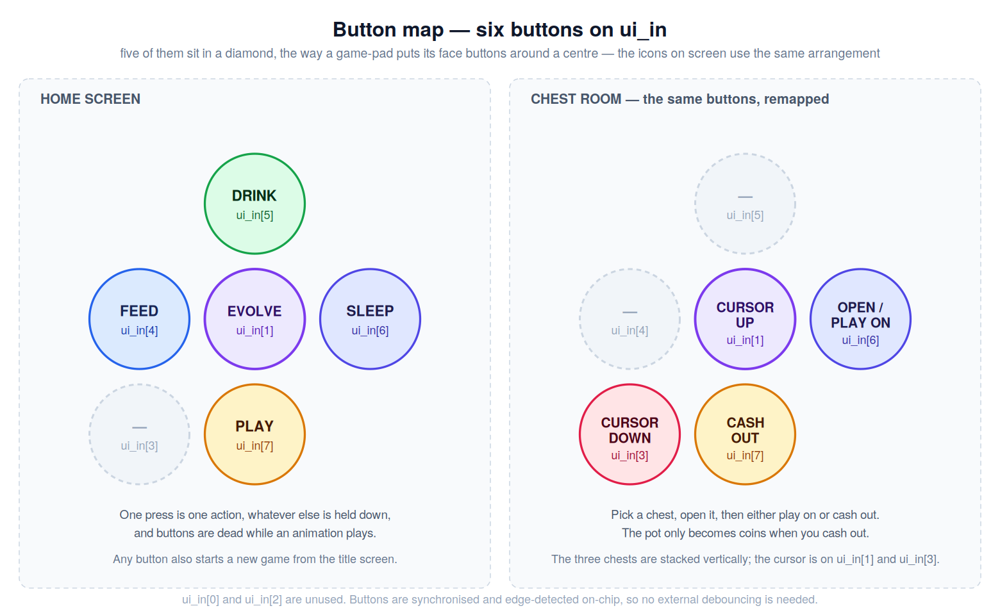

<!---

This file is used to generate your project datasheet. Please fill in the information below and delete any unused
sections.

You can also include images in this folder and reference them in the markdown. Each image must be less than
512 kb in size, and the combined size of all images must be less than 1 MB.
-->

## How it works
**Dragonochi** is a dragon-themed tamagotchi rendered live to a VGA monitor: a virtual hatchling you feed, water, put to sleep and play with until it evolves into an adult dragon.

Two mechanics drive it. The first judges you as an owner, and the rule is moderation — the dragon wants *variety*, not more. Four different actions in a row and it cheers up, and gains a heart if it was already content. Six actions with one of the four missing and it protests, then starts losing hearts. No dragon wants to eat the same thing forever.

The second is the play button: a treasure chest gamble. Open chests to grow a pot of coins, cash out before you hit a bomb, and spend what you keep on evolutions. Pick wrong and you lose the pot, or a heart with it.

Run out of hearts and it is game over; pay for the final evolution and you win.

### One clock, two rates
There is no framebuffer and no RAM. Every pixel is recomputed from the game state as the beam passes over it at the 25.175 MHz pixel clock. 

The game side only needs to change once per frame, so every game register is gated on `frame_tick`. Sampling the buttons at that rate is the debounce. "One press equals one action" works with an edge detector and every animation length is written in frames instead of clock cycles. 

### The blocks. 

`buttons.v` synchronises `ui_in` through two flops and turns each rising edge into a single one-frame pulse, so holding a button down still counts once. 

`home.v` is the mode machine. You start at TITLE, any button takes you to EGG where the egg hatches so you eventually get into HOME. From there PLAY opens the chest room, an empty heart bar goes to GAME OVER, and the last evolution goes to YOU WIN; both end screens return you to TITLE. `home.v` also decides which button wins: inside HOME the buttons are only read while no effect animation is playing, and the checks are a priority chain, so three buttons in the same frame still produce one action. The animation is its own lockout, which is why spamming does nothing. 

`balance.v` keeps a short history of your last actions and applies the variety rule described above. It only requests changes, `dragon_state.v` applies them. 

`dragon_state.v` is the only module that writes hearts (0-5), satisfaction (0-4), coins (0-999) or level (1-7). Keeping all four in one file means simultaneous requests are handled accordingly. 

`chest_game.v` deals three chests, shuffled by `dual_lfsr.v` (two 16-bit LFSRs, the second clocked only when bit 0 of the first is set, so the result does not track the frame counter). A chest holds coins, a doubler, a bomb, or a cursed prize that pays out and costs a heart. Rewards run 40, 60, 100, 160, and from round 4 on there is nothing left but doublers and bombs.

`anim.v` owns everything time-dependent about the picture: the idle bob, day and night, the feed and drink timers, and the evolve sequence. Satisfaction sets the bob speed. 

Two details in there were worth the extra state. A feed or drink request waits in a `pending` register until the bob is back on the ground, then freezes it for the duration, so the feed or drink animation does not get disrupted. 

### Evolving

| Step | 1→2 | 2→3 | 3→4 | 4→5 | 5→6 | 6→7 | win |
|---|---|---|---|---|---|---|---|
| Coins | 90 | 220 | 180 | 250 | 340 | 400 | 999 |

The dragon hatches at level 1 and there are three different evolutions, not seven: levels 1–2, 3–6 and 7 each draw a different dragon. The two steps that actually transform the dragon are priced more — you are paying for the new evolution, not just the number. The two transformations also refill the hearts, so it doubles as a rescue.

Reaching level 7 is not the end. Winning costs one more evolution, and it is priced at 999.

### VGA

The screen is on its side. The VGA raster is the usual 640 × 480 landscape, but the game is drawn in portrait: `px = pix_y` and `py = 639 - pix_x`, so every drawable thinks in a 480 wide by 640 tall screen and the monitor is physically rotated 90°.

Each drawable is a small module that gets local coordinates and answers two things: is this pixel mine, and which colour code. `renderer.v` does the rest in four steps — **place** (subtract each drawable's origin, so moving something on screen is a one-line edit), **show** (which drawables this mode uses), **stack** (a priority cascade, first visible layer wins) and **colour** (code to 6-bit RGB, two bits per channel).

The stack differs per mode:

- *title and egg* — flash, title, crack, egg, "press any button", ground, sky
- *home* — hearts, level, coins, satisfaction bar, buttons, dragon, background
- *chest* — hearts, menu, chest body, icon, lid, background

Where two things use the same table and can never both claim a pixel, there is one lookup with muxed inputs instead of two copies. The dragon and the title egg share a palette because their modes exclude each other; the chest body and lid share theirs because the stack always picks one; and a single `digit_rom` draws the round number, the pot, the coin counter and the level. 

The dragon gets a second palette for night instead of a brightness trick, so the outline stays black while the belly still lifts, and the unpicked chests dim by dropping the low bit of each channel.

## How to test

**In simulation.** to be written 

**On hardware.** Plug the TinyVGA PMOD into the output PMOD, connect a monitor, put 8 buttons on `ui_in`, set the clock to 25.175 MHz and reset. You should get the title screen.

Then: press anything to hatch the egg. Try feed, drink and sleep, and notice that input is ignored until each animation finishes. Alternate all four actions and the satisfaction bar climbs and the dragon bobs faster; repeat one action six times instead and the bar drops and hearts start going. Open a few chests, cash out, and spend the coins on an evolution.

## External hardware

- **TinyVGA PMOD** on the output PMOD, and a VGA monitor. **The monitor has to be rotated 90°** — the game is drawn in portrait.
- **8 push buttons** on `ui_in`. They are synchronised and edge-detected on-chip, so no external debouncing is needed.

| `ui_in` | Home | Chest room |
|---|---|---|
| 1 | evolve | select up |
| 3 | — | select down |
| 4 | feed | — |
| 5 | drink | — |
| 6 | sleep | open chest / continue |
| 7 | play | cash out and leave |

Bits 0 and 2 are unused.